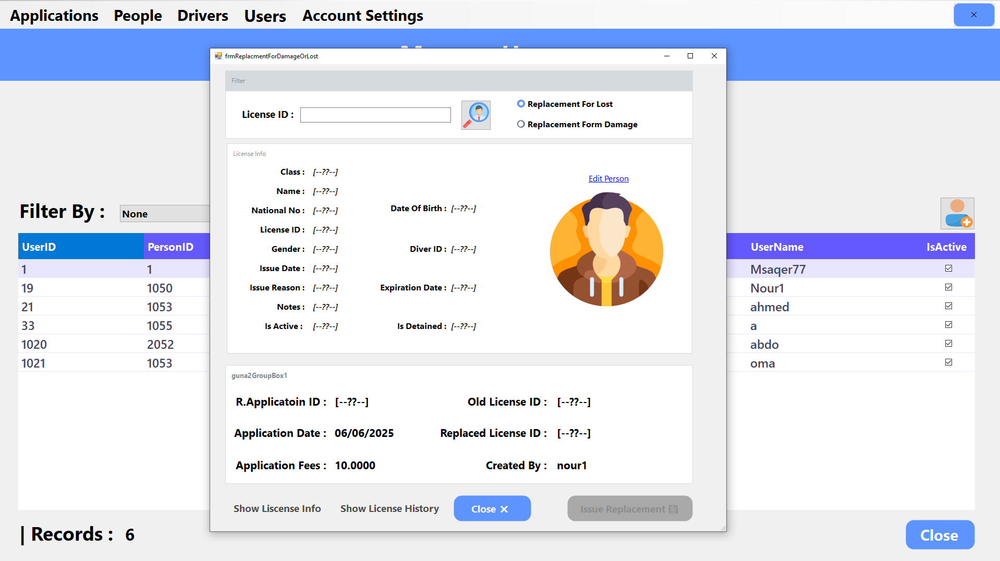

# Driving and Vehicle License Department (DVLD) System

## About

The DVLD System is a comprehensive desktop application designed to manage all aspects of driving licenses and vehicle registration. This Windows Forms application is built using C# and follows a three-tier architecture with separate layers for presentation, business logic, and data access.

The system serves as a complete solution for government driving and vehicle license departments, allowing efficient management of people records, driving licenses, tests, and users with different access levels.

## Key Features

### User Management
Managing system users with the ability to add new users, change login credentials, assign permissions, freeze accounts, and delete users.

### People Management
Complete database of citizens with personal information and history including:
- National ID
- Full name
- Date of birth
- Address
- Phone number
- Email
- Nationality
- Personal photo

### Driver License Management
Issue, renew, and manage all types of driving licenses with different classes:
- Motorcycle licenses
- Regular driver licenses
- Commercial driver licenses
- Agricultural vehicle licenses
- Bus driver licenses
- Heavy truck licenses

### New License Applications
Manage the entire process of new license applications including:
- Application forms and fees ($5 application fee)
- Verification of applicant eligibility based on age requirements
- Vision test scheduling and results ($10 fee)
- Theoretical test scheduling and results ($20 fee)
- Practical driving test scheduling and results (fees vary by license class)
- License issuance with appropriate validity period

### International License
Issue and manage international driving permits for citizens traveling abroad:
- Available only for holders of valid regular driver licenses
- $20 service fee plus $5 application fee
- Validity tracking and renewal options
- Automatic cancellation of previous international license when issuing a new one

### Test Management
Schedule and record results for different types of driving tests:
- Vision tests
- Theoretical knowledge tests
- Practical driving tests
- Retake test scheduling

### Driver Information
Comprehensive driver profiles with:
- License history
- Test history
- License status
- Personal information

### License Detainment
Record and manage license detainments and releases:
- Document detainment reasons
- Set fines
- Record detainment date
- Process license release after payment

### License Replacement
Process for handling lost or damaged license replacements:
- $20 service fee plus $5 application fee
- Verification that license is not detained
- New license issuance with same validity period

## Architecture

The project follows a three-tier architecture:
- **Presentation Layer**: Windows Forms UI (DVLD project)
- **Business Layer**: Business logic and rules (DVLD_Business project)
- **Data Access Layer**: Database operations (DVLD_DataAccess project)

## Database Structure
The system maintains comprehensive records of:
- People (citizens)
- Drivers
- License applications
- License classes
- Tests and appointments
- Users and permissions
- Detainment records

## Technologies Used

- C# Programming Language
- .NET Framework
- Windows Forms
- SQL Server Database
- ADO.NET for database connectivity
- Crystal Reports for reporting

## Installation

1. Clone the repository
2. Open the solution in Visual Studio
3. Restore the database backup (DVLD.bak)
4. Update the connection string in the configuration file
5. Build and run the application

## Default Login

- Username: nour1
- Password: Nnour

## License

This project is licensed under the MIT License - see the LICENSE file for details. 